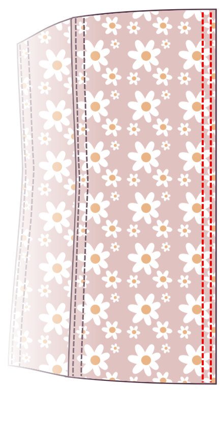
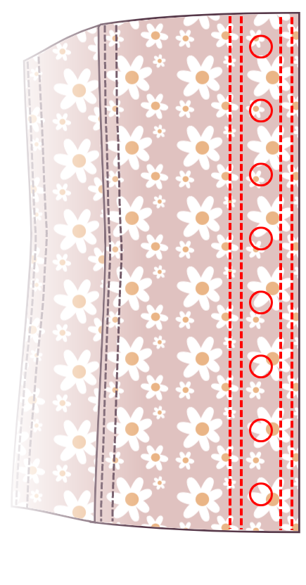

<Note>

#### Es gibt viele Möglichkeiten, ein Korsett zu konstruieren

Diese Anleitung ist nur eine davon. With this method, I recommend using a wider seam allowance of at least 1.5cm so that your boning channels fit comfortably inside the seam allowance.

Beginner corset makers should read the tutorials written by [Sidney Eileen](http://www.sidneyeileen.com), who demonstrates several different construction methods. [Foundations Revealed](https://www.foundationsrevealed.com) is a paywall site for corset makers, with several exceptional articles free for non members.

#### Check the original tutorial
This pattern is based on [this tutorial by Cathrin Alen](https://katafalk.wordpress.com/2010/06/24/underbust-pattern-tutorial/). Cathrin also has [this informative post on making corsets](https://katafalk.wordpress.com/2009/05/03/how-i-sew-corsets/) on her blog which you might find helpful.

</Note>

## Step 1: Sew boning channels in center front

Start with the center front pieces. For an 11-panel Cathrin, this will be Panel 1. Place the outer Panel 1 on the core Panel 1, bad sides together.

With a small stitch width (I set mine to “2”), sew a line straight down the center front. Then sew two boning channels to either side, allowing a bit of extra space, about 2mm, in addition to the width of your boning.

## Step 2: Attach the first side panel

Take the next piece. For an 11-panel Cathrin, this will be Panel 2.

Place the outer Panel 2 on the outer Panel 1, _good sides together_.

Place the core Panel 2 on the core Panel 1, _good sides together_.

Ensure that the four layers of fabric line up perfectly. Double check that you haven’t mixed up pattern pieces or flipped any over by mistake.

Match up the four layers of fabric at the narrowest part, _good sides together_, and pin. Then match the top and bottom of each panel and pin. Finally, pin the rest of the edge in place. Use as many pins as needed to make sure the panels stay perfectly aligned.

Sew the seam.

## Step 3: Sew the boning channel

Press both layers of Panel 2 away from the center, using the iron to ease the material where the seams curve.

Edgestitch right along the folded edge, just 1-2mm from the seam line. Sew slowly and keep an eye on the stitching to ensure that the distance is kept even at all times. The purpose of adding this topstitch line is to relieve some stress from the connecting seam.

Topstitch another seam parallel to the first seam, allowing a bit of extra space, about 3mm, in addition to the width of your boning.

## Step 4: Attach the next panel

Take the next piece. For an 11-panel Cathrin, this will be Panel 3.

Place the outer Panel 3 on the outer Panel 2, _good sides together_.

Place the core Panel 3 on the core Panel 2, _good sides together_.

Match up the four layers of fabric at the narrowest part, _good sides together_, and pin. Then match the top and bottom of each panel and pin. Finally, pin the rest of the edge in place. Use as many pins as needed to make sure the panels stay perfectly aligned.

Sew the seam.

## Step 5: Sew another boning channel

Press both layers of Panel 3 away from the center, using the iron to ease the material where the seams curve.

Edgestitch right along the folded edge, just 1-2mm from the seam line.

Topstitch another seam parallel to the first seam, allowing a bit of extra space, about 2mm, in addition to the width of your boning.

This new boning channel should look just like the one you made attaching Panel 2 to Panel 1.

## Step 6: Continue attaching the side panels

Continue attaching panels, creating a boning channel in each seam. Attach Panel 4 to Panel, Panel 5 to Panel 4, and finally Panel 6 to Panel 5.

Repeat these steps on the other side.

## Step 7: Finish the corset back

With all of your panels connected, you’re working with the flat sides of each Panel 6.

Fold the seam allowance of both pieces inward so that the seam allowance is hidden. Press flat, then top stitch close to the edge.

Topstitch another seam next to the edgestitched seam, allowing a bit of extra space, about 2mm, in addition to the width of your boning.

Mark the locations of your grommets. (Don’t insert them yet. Just mark the fabric where you’ll place them, and make sure you’re creating a strip suited to the width of your grommets.)

Top stitch on the opposite side of the grommet markings, then shift and topstitch another seam parallel to the topstitched seam, again leaving enough space for the boning.

Repeat on the other side.

## Step 8: Insert boning

Insert boning in all of the channels.

## Step 9: Bind the top and bottom

Use bias tape or ribbon to bind the top and bottom edges of the corset.

## Step 10: Set the grommets

Set the grommets in the locations you marked earlier.

## Step 11: Lace the corset

You’re done!
